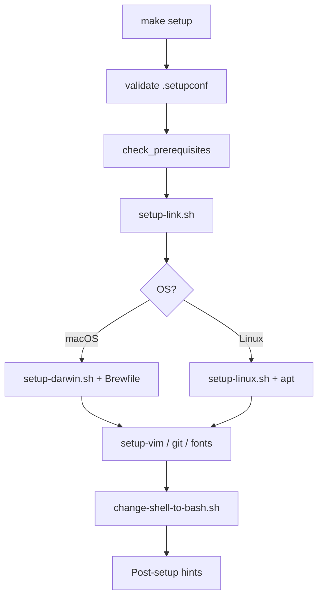

# Repository layout

```
dotfiles/
├── Brewfile              # macOS default Homebrew packages
├── Brewfile.work         # macOS work-only packages (make work-installation)
├── Makefile              # setup, lint, work-installation, …
├── bash_profile, zshrc   # Shell entrypoints → source env, aliases, …
├── aliases.sh            # Shell aliases (e.g. killport)
├── vimrc, nvim/          # Vim / Neovim (lazy.nvim)
├── helix/                # Helix editor config
├── setup/
│   ├── setup.sh          # Main orchestrator (all platforms)
│   ├── setup-darwin.sh   # Homebrew, macOS defaults
│   ├── setup-linux.sh    # apt, Docker, AWS CLI, …
│   ├── setup-link.sh     # Symlink dotfiles into $HOME
│   ├── setup-git.sh      # Git identity and keys
│   ├── setup-vim.sh      # Neovim / Vim deps
│   ├── setup-fonts.sh    # Powerline fonts
│   └── change-shell-to-bash.sh
├── lib/setup-utils.sh    # Logging, symlinks, OS helpers
└── docs/                 # PACKAGES.md, STRUCTURE.md
```

## Setup flow



## What gets linked

| Repo path | Linked to |
|-----------|-----------|
| `bash_profile` | `~/.bash_profile` |
| `zshrc` | `~/.zshrc` |
| `vimrc` | `~/.vimrc` |
| `nvim/init.lua` | `~/.config/nvim/init.lua` |
| `helix/*.toml` | `~/.config/helix/` |
| `gitconfig`, `gitignore` | `~/.gitconfig`, `~/.gitignore` |
| `tmux.conf` | `~/.tmux.conf` |
| `ssh_config` | `~/.ssh/config` |

Existing targets are backed up with a timestamp suffix before replacing.
